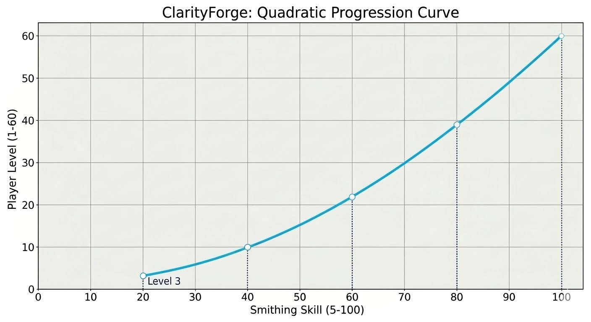
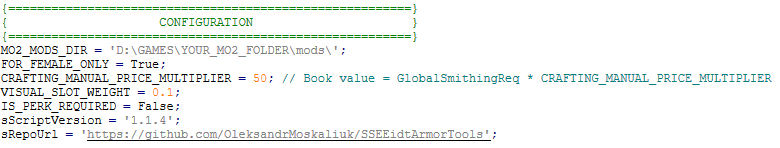

---

## 📜 ClarityForge: Preparation & Usage Guide

**ClarityForge** is a metadata-driven balancing and sanitization engine for Skyrim SE/AE. It uses **MO2 Metadata** to determine progression and material types, allowing you to balance outfits across different mods without ever renaming your `.esp` files.

---

## 🏷️ The NameCode System (MO2 Metadata)

The script identifies mods by scanning the **Notes** field in your Mod Organizer 2 entries.

### **How to Tag a Mod:**

Add the NameCode to your mod's **Notes** in the MO2 UI.
**Pattern:** `[Any Text] CF_[MaterialCode][SmithingLevel]`
**Example Note:** `Dark Elf Blader - CBBE 3BA CF_En74`

### **Supported Material Codes**

| Category | Code | Material | Code | Material |
| --- | --- | --- | --- | --- |
| **Light** | **Lr** | Leather | **Gs** | Glass |
|  | **Sd** | Scaled | **De** | Dragonscale |
|  | **En** | Elven |  |  |
| **Heavy** | **In** | Iron | **Se** | Steel Plate |
|  | **Sl** | Steel | **Oh** | Orcish |
|  | **Dn** | Dwarven | **Ey** | Ebony |
|  | **Dc** | Daedric | **Dp** | Dragonplate |

> **Note on Scaling:** In the example above, `74` represents the **Smithing Skill** required. The script uses this number to calculate the actual **Character Level** requirement automatically.

---

## ⚖️ Non-Linear Progression (Skill vs. Level)

ClarityForge distinguishes between your **Crafting Skill** and your **Character Level**. By entering a Smithing Level in the MO2 Note, the script generates a balanced Character Level requirement using a **Quadratic Curve**.

**The Level Formula:** 

$$PlayerLevel = 1 + (59 \times (\frac{SmithingSkill}{100})^2)$$

| Smithing Skill (Tag) | Character Level Req |
| --- | --- |
| **5** | **Level 1** |
| **20** | **Level 3** |
| **40** | **Level 10** |
| **60** | **Level 22** |
| **74** | **Level 33** |
| **80** | **Level 39** |
| **100** | **Level 60** |

---

## 🧩 Compatibility & Overhauls (3BFTweaks / Requiem)

* **Perk-Free Gating:** Set `IS_PERK_REQUIRED` to `False` to ensure compatibility with overhauls that change Perk IDs. Crafting relies strictly on your numerical **Smithing Skill** and **Character Level**.
* **Jewelry & Circlet Logic:** Items in **Slot 42 (Circlet)**, **Ears**, **Rings**, or **Amulets** are forced to **Clothing**. This prevents them from breaking "Mage Armor" perks.
* **Helmet Definition:** Items using **Slot 30 (Head)** or **Slot 31 (Hair)** are treated as functional **Armor**.

---

## 🛠️ Mandatory Script Setup

1. **Global Path Configuration:**
Set your physical MO2 mods directory in `ClarityForge.pas`:
`const MO2_MODS_DIR = 'D:\GAMES\MO2\mods\';`

2. **Record Preparation (BOD2 Flags):**
Ensure armor records have correct **First Person Flags**. This distinguishes **Gameplay Slots** (Cuirass, Boots) from **Visual Slots** (Capes, Accessories).
	
---

## 📖 The Crafting Manual System

ClarityForge generates a **Unique Crafting Manual** for every processed mod to keep your forge menu clean.

* **Unlock Requirement:** You must have the manual in your inventory to see or craft the items.
* **Dynamic Naming:** Manuals use the `.esp` name + material + level.
* *Example:* `[COCO] 2B Wedding Outfit Elven Lv 74 Book`
* **Pricing:** The gold value scales with tier: `SmithingReq * 50`. (Level 74 manual = **3,700g**).
* **Forge Cleanup (Nullification):** Original recipes are rendered "homeless" by removing their Workbench Keyword, preventing menu clutter.

---

## ⚙️ Internal Logic & Safety

### **The "One BOD2 Flag" Rule**

For proper classification, each record should ideally have exactly **one** primary body slot set.

* **Full Body Suits:** If a mod uses a single record to cover Body, Hands, and Feet, the script defaults it to **Cuirass** logic.
* **Conflict Warning:** Since a suit occupies multiple slots, the player cannot equip separate boots or gauntlets alongside it; the engine will swap the items to prevent slot overlap.

### **Visual Slot Finalization**

* **Exploit Protection:** Injects **Dummy Enchantments** into accessories to prevent "Enchantment Swapper" exploits.
* **Normalized Stats:** Accessories and Jewelry are set to **Weight 0.1** and **Armor Rating 0**.

---

## 🚫 Critical Warnings

* **Metadata Dependency:** If the `CF_` tag is missing from the MO2 Note, the script will skip the file.
* **One BOD2 Flag Rule:** Each record **must** have exactly **one** primary `BOD2` flag set for proper classification (Helmet, Hands, etc.).

---
