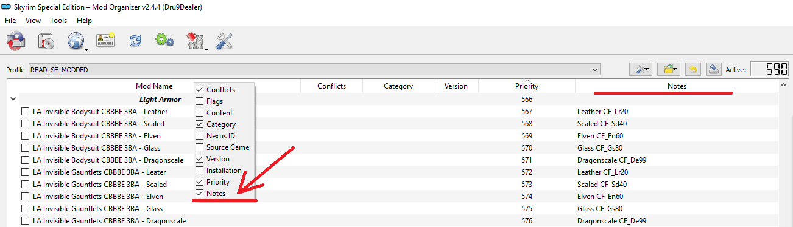
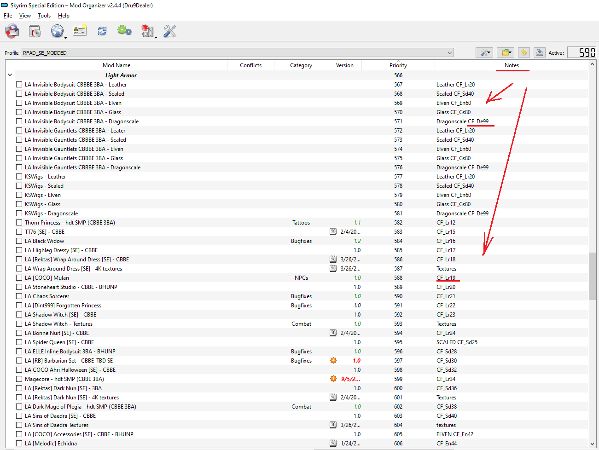
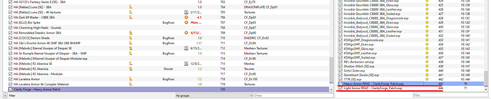

---

## 📜 ClarityForge: Usage Guide

**ClarityForge** is a metadata-driven balancing and sanitization engine for Skyrim SE/AE. It uses **MO2 Metadata** to determine progression and material types, allowing you to balance outfits across different mods.
For the **Preparation Before Script Running** section, here is a clean, structured layout you can use in your `README.md`:

## 📦 Installation

To install **ClarityForge**, place the script files into your xEdit (SSEEdit) scripts directory:

Copy `ClarityForge.pas` and `SK_UtilsRemake.pas` into your SSEEdit installation folder under `Edit Scripts/`:

SSEEdit/
└── Edit Scripts/
	├── ClarityForge.pas
	└── SK_UtilsRemake.pas

## ⚙️ Preparation Before Script Running

Before executing the script in xEdit (SSEEdit), ensure your environment and plugin load order are properly configured.

### 1. Script Path Setup
Set the path to your Mod Organizer 2 mods directory inside `ClarityForge.pas`:

const MO2_MODS_DIR = 'D:\GAMES\MO2\mods\';

### 2. Plugin Selection in xEdit

When launching xEdit, you must load all relevant `.esp` / `.esm` files that your setup depends on for the script to resolve records correctly. It is generally recommended to select all active plugins, but pay special attention to mandatory master files based on your setup:

* **Base Requirements:**
* `Skyrim.esm`
* `Update.esm`

* **Requiem Setups:**
* `Requiem.esm`

* **Requiem for a Dream (RFAD) Setups:**
* `Requiem.esm`
* `Update.esm`
* `Fozars_Dragonborn_-_Requiem_Patch.esp`

> **Note:** Make sure all required plugins are checked in the xEdit module selection window before proceeding with the script execution.

---

## 🏷️ The NameCode System (MO2 Metadata)

The script identifies mods by scanning the **Notes** field in your Mod Organizer 2 entries.

### **How to Tag a Mod:**

Add the NameCode to your mod's **Notes** in the MO2 UI.
**Pattern:** `[Any Text] CF_[MaterialCode][SmithingLevel]`
**Example Note:** `Dark Elf Blader - CBBE 3BA CF_En74`

### **Supported Material Codes**

| Category | Material | Code |
| --- | --- | --- |
| Light Armor | Leather  | **Lr** | Leather |
| Light Armor | Scaled | **Sd** | Scaled |
| Light Armor | Elven | **En** | Elven |
| Light Armor | Glass | **Gs** | Glass |
| Light Armor | Dragonscale | **De** | Dragonscale |
| Heavy Armor | Iron | **In** |  Iron |
| Heavy Armor | Steel | **Sl** | Steel |
| Heavy Armor | Dwarven | **Dn** | Dwarven |
| Heavy Armor | Steel Plate | **Se** | Steel Plate |
| Heavy Armor | Orcish | **Oh** | Orcish |
| Heavy Armor | Ebony | **Ey** | Ebony |
| Heavy Armor | Daedric | **Dc** | Daedric |
| Heavy Armor | Dragonplate | **Dp** | Dragonplate |

> **Note on Scaling:** In the example above, `CF_Lr19`, number `19` represents the **Smithing Skill** required. The script uses this number to calculate the actual **Character Level** requirement automatically.

---

---

## 🧩 Compatibility & Overhauls (3BFTweaks / Requiem)

* **Perk-Free Gating:** Set `IS_PERK_REQUIRED` to `False` to ensure compatibility with overhauls that change Perk IDs. Crafting relies strictly on your numerical **Smithing Skill** and **Character Level**.
* **Jewelry & Circlet Logic:** Items in **Slot 42 (Circlet)**, **Ears**, **Rings**, or **Amulets** are forced to **Clothing**. This prevents them from breaking "Mage Armor" perks.
* **Helmet Definition:** Items using **Slot 30 (Head)** or **Slot 31 (Hair)** are treated as functional **Armor**.

---

## ⚙️ Script Configuration

Before running the script in xEdit, open `ClarityForge.pas` and adjust the variables in the `CONFIGURATION` block to match your setup:

const
	// Path to your Mod Organizer 2 mods folder. Mandatory!
	// Ensures the script can read metadata notes attached to your mods.
	MO2_MODS_DIR = 'D:\GAMES\RfaD SE\MO2\mods\';

	// When set to True, all processed armors and outfits will be restricted to female characters only.
	FOR_FEMALE_ONLY = True;

	// Set to True if playing with Requiem or Requiem for a Dream (RFAD).
	FOR_REQUIEM = True;

	// Adds special RFAD armor resistances. Set to False for Vanilla Skyrim or standard Requiem setups.
	FOR_RFAD = True;

	// Enables the quadratic level curve gating. Prevents crafting high-tier gear too early by requiring a minimum character level.
	USE_LEVEL_CURVE = True;

	// Multiplier for crafting manual prices (Formula: Smithing Skill Req × Multiplier).
	CRAFTING_MANUAL_PRICE_MULTIPLIER = 25;

	// Base weight assigned to non-standard body slots (accessories/visual slots).
	VISUAL_SLOT_WEIGHT = 0.1;

	// Set to True if crafting should require material perks in addition to skill levels. (Compatible with Requiem; untested on RFAD).
	IS_PERK_REQUIRED = False;
	
---

## ⚖️ Non-Linear Progression (Skill vs. Level)

ClarityForge distinguishes between your **Crafting Skill** and your **Character Level**. By entering a Smithing Level in the MO2 Note, the script generates a balanced Character Level requirement using a **Quadratic Curve**.

Only available if **USE_LEVEL_CURVE = True;**

**The Level Formula:** 

$$PlayerLevel = 1 + (59 \times (\frac{SmithingSkill}{100})^2)$$

| Smithing Skill (Tag) | Character Level Req |
| --- | --- |
| **5** | **Level 1** |
| **20** | **Level 3** |
| **40** | **Level 10** |
| **60** | **Level 22** |
| **74** | **Level 33** |
| **80** | **Level 39** |
| **100** | **Level 60** |

---

## 📖 The Crafting Manual System

ClarityForge generates a **Unique Crafting Manual** for every processed mod to keep your forge menu clean.

* **Unlock Requirement:** You must have the manual in your inventory to see or craft the items.
* **Dynamic Naming:** Manuals use the `.esp` name + material + level.
* *Example:* `[COCO] 2B Wedding Outfit Elven Lv 74 Book`
* **Pricing:** The gold value scales with tier: `SmithingReq * CRAFTING_MANUAL_PRICE_MULTIPLIER`. (Level 74 manual = **3,700g**).
* **Forge Cleanup (Nullification):** Original recipes are rendered "homeless" by removing their Workbench Keyword, preventing menu clutter. Instead new recipes will be created.

---

## ⚙️ Internal Logic & Safety

### **The "One BOD2 Flag" Rule**

For proper classification, each record should ideally have exactly **one** primary body slot set.

* **Full Body Suits:** If a mod uses a single record to cover Body, Hands, and Feet, the script defaults it to **Cuirass** logic.
* **Conflict Warning:** Since a suit occupies multiple slots, the player cannot equip separate boots or gauntlets alongside it; the engine will swap the items to prevent slot overlap.

### **Visual Slot Finalization**

* **Exploit Protection:** Injects **Dummy Enchantments** into accessories to prevent "Enchantment Swapper" exploits.
* **Normalized Stats:** Accessories and Jewelry are set to **Weight 0.1** and **Armor Rating 0**. Means they wil not have impact on gameplay.

---

## 💾 Script Output & Finalization

When **ClarityForge** completes its run, it automatically generates a new plugin named `ClarityForge.esp` containing all created recipes, manual books, and balanced armor records.

### 1. File Handling & Renaming
**File Existence Limit:** The script cannot run if `ClarityForge.esp` already exists in your load order or output folder.
If it exists, xEdit will throw an error and abort the script.
**Segmenting Large Load Orders:** If you have a large number of armors and outfits, it is recommended to process them in batches (e.g., process Light Armors first, then Heavy Armors):
	1.Select and run the script on Light Armors. 
	2.Rename the resulting `ClarityForge.esp` to something specific, such as `ClarityForge - Light Armors.esp`. 
	3.Run the script on Heavy Armors. 
	4.Rename the second generated plugin to `ClarityForge - Heavy Armors.esp`.

### 2. Load Order Placement
* Always place all generated `ClarityForge` plugins (e.g., `ClarityForge.esp`, `ClarityForge - Light Armors.esp`, `ClarityForge - Heavy Armors.esp`) at the **very bottom of your mod load order**.
* This ensures that all modified recipes, manual books, and armor records properly override their original mod records without being overwritten by other patches or plugins.

---

## 🚫 Critical Warnings

* **Metadata Dependency:** If the `CF_` tag is missing from the MO2 Note, the script will skip the file.
* **One BOD2 Flag Rule:** Each record **must** have exactly **one** primary `BOD2` flag set for proper classification (Helmet, Hands, etc.).

---
